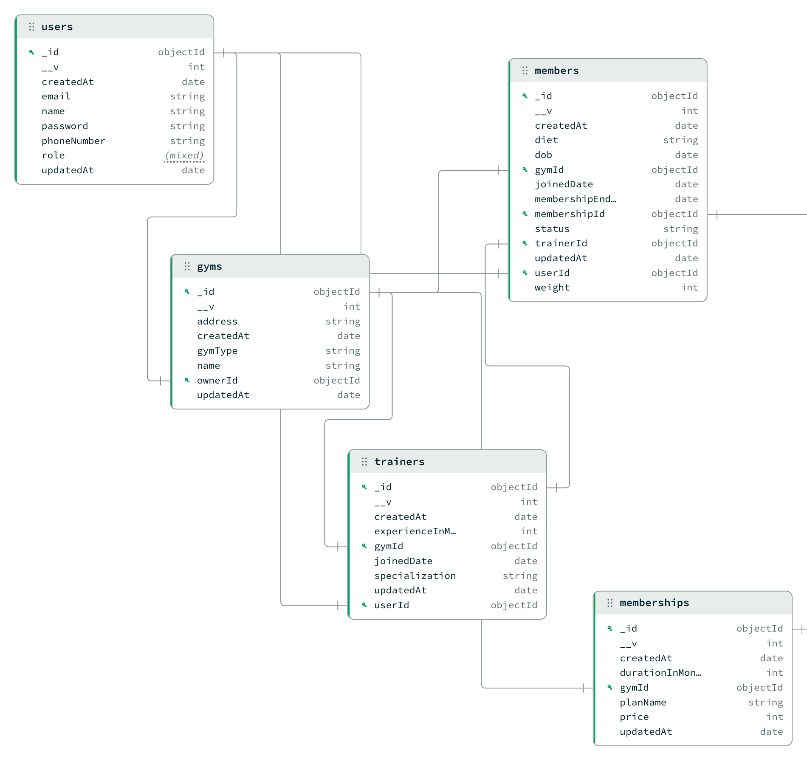

# 🏋️ Gym Management System - Backend

A RESTful backend for a Gym Management System built using Node.js, Express.js, TypeScript and MongoDB.

It allows gym owners to manage gyms, trainers, members and membership plans through secure JWT authentication.

---

## 🗂️ Database Schema



# ✨ Features

- JWT Authentication
- Role Based Access
- Gym Registration
- Owner Login
- Dashboard Analytics
- Member Management
- Trainer Management
- Membership Management
- Password Hashing (bcrypt)
- MongoDB with Mongoose
- TypeScript

---

# 🛠 Tech Stack

- Node.js
- Express.js
- TypeScript
- MongoDB
- Mongoose
- JWT
- bcrypt
- CORS
- dotenv

---

# 📂 Project Structure

src
│
├── controllers
├── models
├── routes
├── middleware
├── utils
├── database
├── index.ts

---

# 🚀 Quick Start

## 1 Clone Repository

git clone <repository-url>

cd Gym_Management

---

## 2 Install Dependencies

npm install

---

## 3 Configure Environment Variables

Create a `.env` file.

```
PORT=3000

MONGODB_URI=your_mongodb_connection_string

JWT_SECRET=your_secret_key
```

---

## 4 Run Development Server

```
npm run dev
```

---

## 5 Build

```
npm run build
```

---

## 6 Production

```
npm start
```

---

# 🔐 Authentication APIs

## Register Gym Owner

POST

```
/api/user/register/gym
```

Creates

- Owner
- Gym
- JWT Ready Login

---

## Login

POST

```
/api/user/login
```

Returns

- JWT Token
- User Information

---

# 👤 Profile APIs

## Get Profile

GET

```
/api/gym/profile
```

Returns logged-in owner's profile.

---

## Update Gym

PATCH

```
/api/gym/profile/gym
```

Updates gym details.

---

## Dashboard

GET

```
/api/gym/dashboard
```

Returns

- Total Members
- Total Trainers
- Total Membership Plans
- Total Revenue

---

# 👥 Member APIs

## Add Member

POST

```
/api/gym/members
```

Creates a member and assigns:

- Trainer
- Membership

---

## Get Members

GET

```
/api/gym/members
```

Returns all gym members.

---

## Get Member

GET

```
/api/gym/members/:id
```

Returns member details.

---

## Update Member

PATCH

```
/api/gym/members/:id
```

Updates member information.

---

## Delete Member

DELETE

```
/api/gym/members/:id
```

Deletes member.

---

# 💪 Trainer APIs

## Add Trainer

POST

```
/api/gym/trainers
```

Creates a trainer.

---

## Get Trainers

GET

```
/api/gym/trainers
```

Returns all trainers.

---

## Get Trainer

GET

```
/api/gym/trainers/:id
```

Returns trainer details.

---

## Update Trainer

PATCH

```
/api/gym/trainers/:id
```

Updates trainer.

---

## Delete Trainer

DELETE

```
/api/gym/trainers/:id
```

Deletes trainer.

---

# 🏆 Membership APIs

## Add Membership

POST

```
/api/gym/memberships
```

Creates a membership plan.

---

## Get Memberships

GET

```
/api/gym/memberships
```

Returns all membership plans.

---

## Get Membership

GET

```
/api/gym/memberships/:id
```

Returns membership details.

---

## Update Membership

PATCH

```
/api/gym/memberships/:id
```

Updates membership.

---

## Delete Membership

DELETE

```
/api/gym/memberships/:id
```

Deletes membership.

---

# 🔒 Protected Routes

All `/api/gym/*` routes require:

```
Authorization: Bearer <JWT_TOKEN>
```

---

# 📸 Screenshots

- Login
- Dashboard
- Members
- Trainers
- Memberships
- Add Member
- Add Trainer
- Add Membership

---

# 🎥 Demo

Add your demo GIF or video here.

---

# 👨‍💻 Author

**Sidharth Chauhan**
